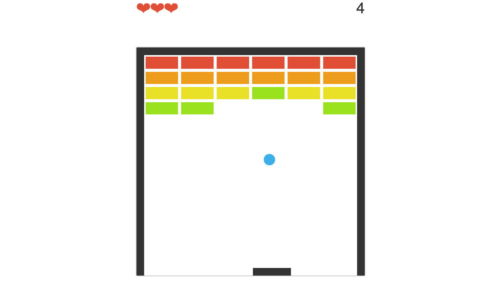

# Arkanoid

A simple HTML5 canvas game built with Typescript using object-oriented approach (January 2017).

## How to run
 - `cd` into the project directory
 - run `npm install` to get all dependencies
 - run `tsc` to compile the app
 - Open index.html file with web browser of your choice
